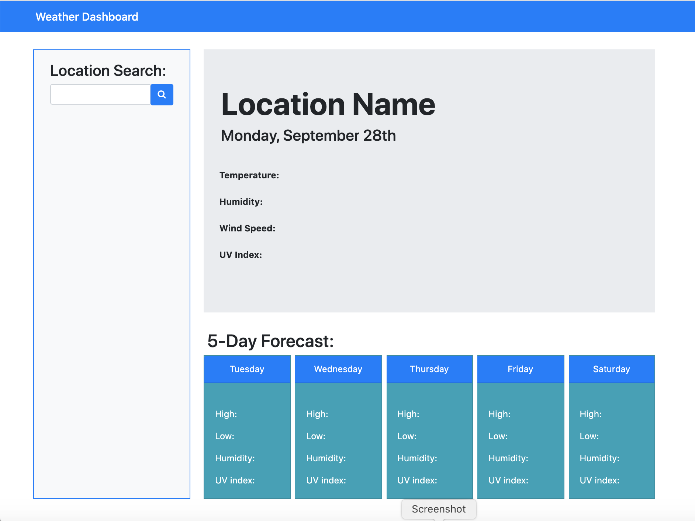
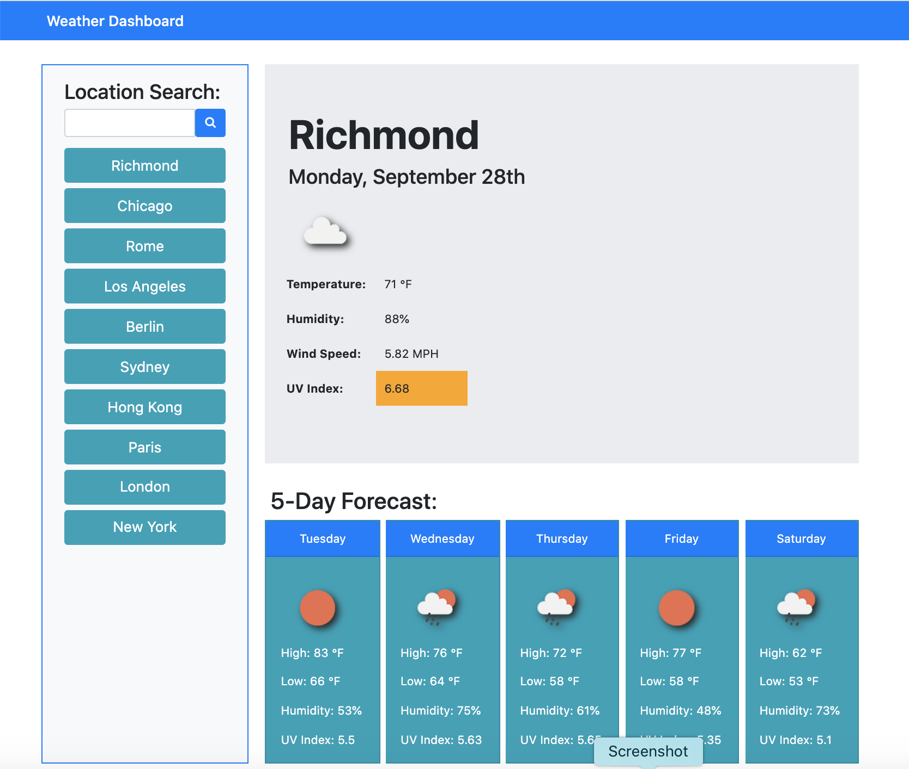

# weather-dashboard

This weather app allows the user to see the weather outlook for multiple cities based on the results from openweather API.

When the user searches for a location in the Location Search area, they are presented with the current weather conditions, as well as the 5 day forecast. The data that is returned for each day is temperature, humidity, wind speed, UV index, and icon for that day's weather. That location is then added to the search history in a column under the search bar.

The UV index is presented with a color that indicates whether the conditions are favorable, moderate, or severe.

The five day forecast displays the day of the week, the high and low temperatures for that day, as well as the humidity and UV index.

When the user clicks on a location in the search history, they are presented with the current and future conditions for that city.

When the user opens the dashboard, they are presented with the last searched location forecast.

